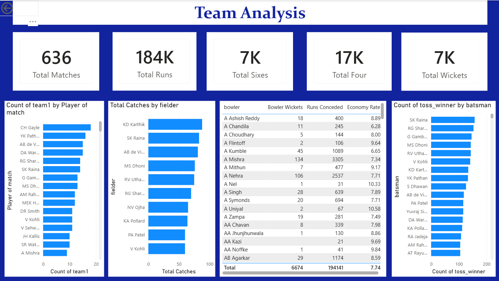
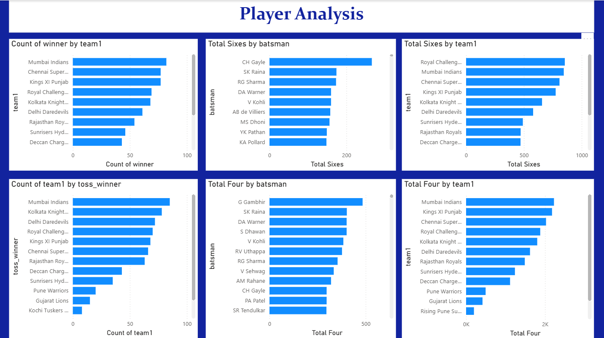
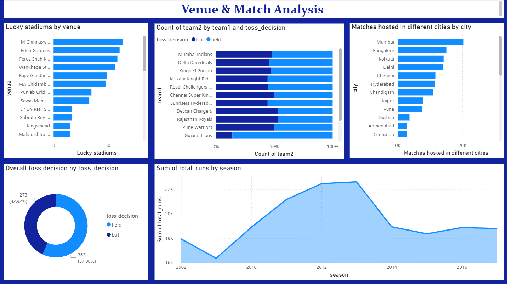

# IPL Data Analysis Project (Power BI)

## 📌 Business Objective
The goal of this project is to analyze Indian Premier League (IPL) matches and player performances to understand what factors drive a team to win matches, ultimately helping teams optimize their match strategies using data-driven insights.

---

## 📊 Business Problems Solved
This dashboard answers key stakeholders' questions, including:
* Which teams perform best overall?
* Does winning the toss significantly help in winning the match?
* Which stadiums act as "lucky" venues for specific teams?
* Who are the most consistent batsmen and dominant bowlers in the league?

---

## 🛠️ Project Workflow & Technical Architecture

### 1. Data Cleaning (Power Query)
* **Standardized Team Names:** Unified old/changed team names for accurate historical evaluation (e.g., converted "Delhi Daredevils" to "Delhi Capitals").
* **Data Type Integrity:** Verified proper formatting for Dates, Numeric fields (Runs, Wickets), and Text fields.
* **Null Values & Duplicates:** Handled empty records logically and eliminated redundant data rows.

### 2. Data Modeling
Established a solid star schema layout by creating a **One-to-Many Relationship** between our primary datasets:
`matches.id` (One) ↔ `deliveries.match_id` (Many)

### 3. Key Metrics Created (DAX Measures)
* **Batting:** Total Runs, Strike Rate, Total Sixes & Fours, and Highest Individual Scores.
* **Bowling:** Total Wickets taken, Economy Rates, and Best Bowling Figures.
* **Team Performance:** Total Overall Wins, Toss Win %, and Win % After Winning Toss.

---

## 🖥️ Dashboard Previews & Visuals

### Dashboard 1: Team Analysis
*Visualizes historical team success, toss win impacts, and boundaries hit by each franchise.*

### Dashboard 2: Player Analysis
*Showcases top run-scorers, leading wicket-takers, and consistent Player of the Match winners.*

### Dashboard 3: Venue & Match Analysis
*Highlights city-wise match distribution, toss decisions (Bat/Field), and high-performing stadiums.*

---

## 💡 Strategic Insights & Recommendations
* **Toss Strategy:** In stadiums where the data shows chasing teams win more frequently, captains should explicitly choose to field first upon winning the toss.
* **Squad Building:** Teams should prioritize recruiting players based on long-term performance consistency over sheer name recognition.
* **Venue Customization:** Match tactics must change by ground, as specific stadiums heavily favor spin/pace bowlers while others are purely batting-friendly tracks.
